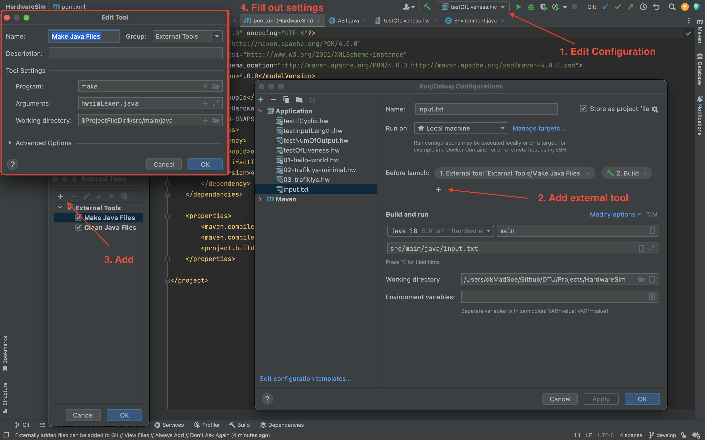

To run the program with Make navigate to src/main/java you could use these commands:
```
make
make tree // Generate the parsetree
make test // Run the input.txt
make clean // Remove autogenerated and out files
```

To run the program with IntelliJ and Maven, sync the pom.xml file and do the following steps.
1. Go to Edit Configuration
2. Select input.txt and add external tool
3. Press the add symbol
4. Fill out settings:
   1. Program: make
   2. Arguments: hwsimLexer.java (NB: To add make clean, add a new external tool and write "clean" in arguments instead)
   3. Working Directory: $ProjectFileDir$/src/main/java
5. You should now be able to run the input.txt file.

